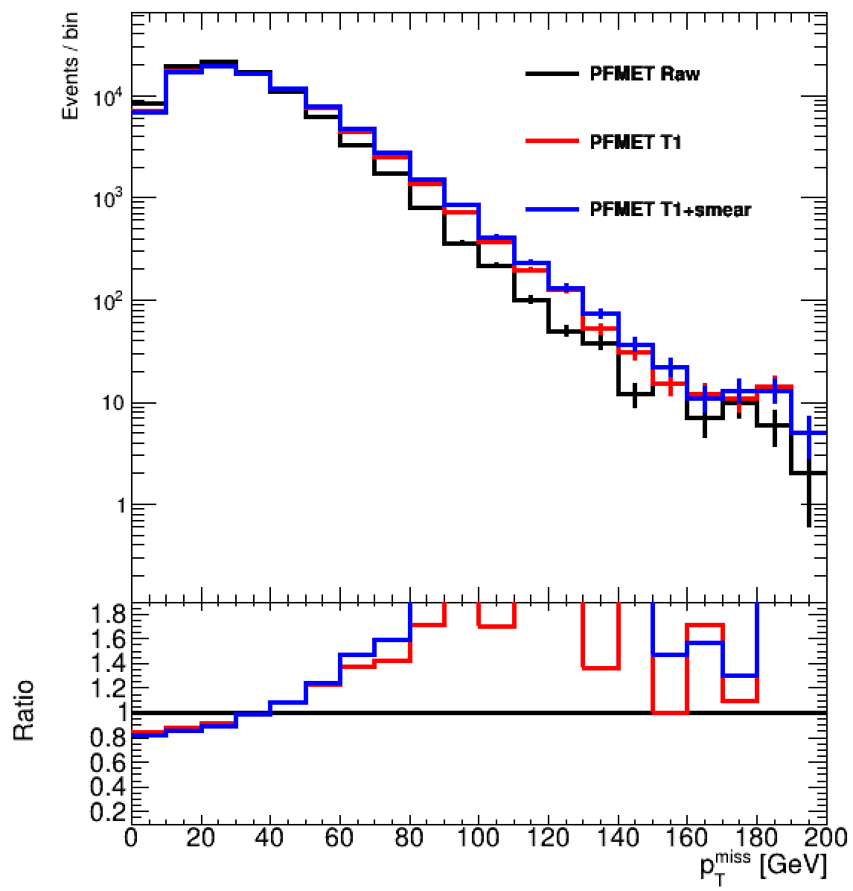
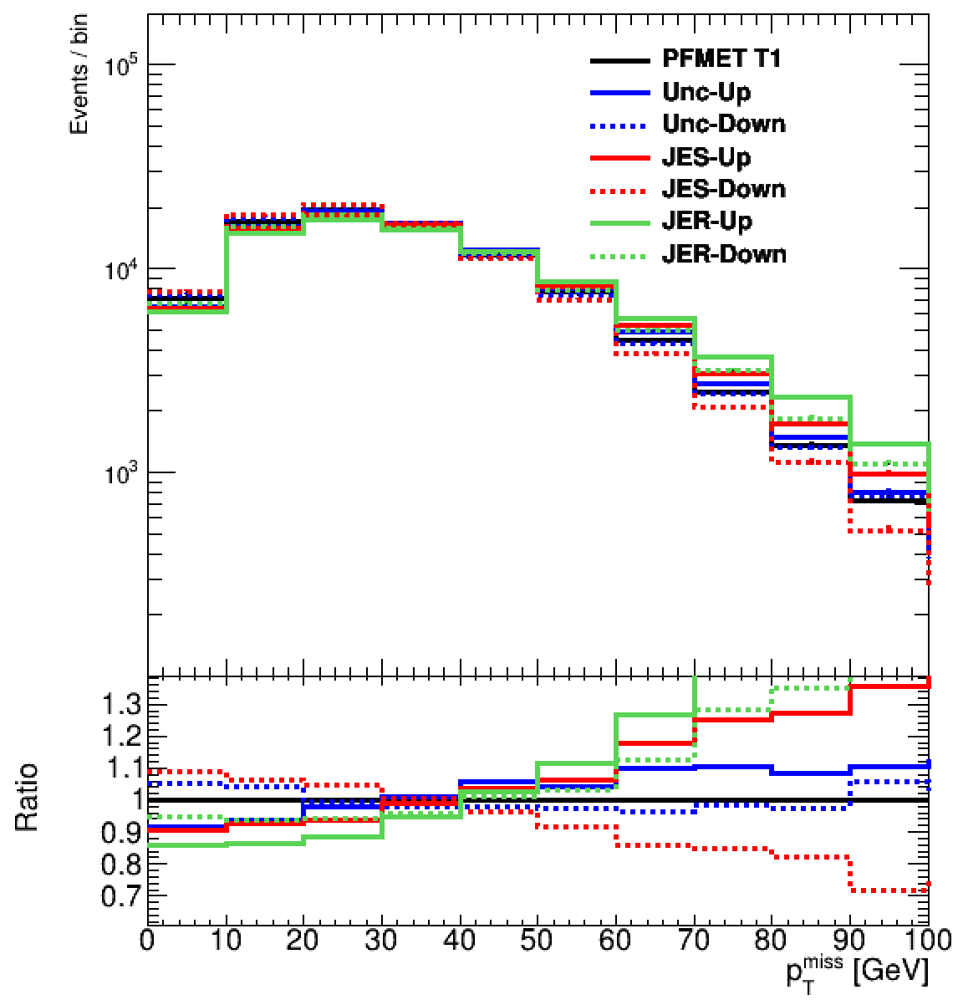

> ## After following the instructions in the setup, make sure you have the CMS environment:
>
> ~~~
> cd $CMSSW_BASE/src/Analysis
> cmsenv
> ~~~
> {: .language-bash}
{: .callout}

## MET Corrections

$$\vec{p}_{T}^{~miss,~raw} = - \sum_{i \in all} \vec{p}_{T, i} $$

The MET objects described earlier (PF-MET and PUPPI-MET) are referred to as _raw_ MET, and they are systematically different from the _true_ MET, which corresponds to the transverse momentum carried by invisible particles.
This difference arises from factors such as the non-compensating nature of the calorimeters, calorimeter thresholds, and detector misalignment, among others.
To improve the MET estimate and make it closer to the true MET, corrections can be applied. 


### Type-1 Correction

The **Type-I correction** is the most commonly used MET correction in CMS.
It propagates the jet energy corrections (JEC) to MET. Specifically, the Type-I correction replaces the vector sum of the transverse momenta of particles clustered as jets with the vector sum of the transverse momenta of the jets, which have been corrected with JEC.

Particles can be classified into two disjoint sets: those that are clustered as jets and those that remain unclustered.

$$\vec{p}_{T}^{~miss,~raw} = - \sum_{i \in jets} \vec{p}_{T, i} - \sum_{i \in uncl} \vec{p}_{T, i}$$

The first vector sum corresponds to the total pT of all jets:

$$\sum_{i \in jets} \vec{p}_{T, i} = \sum_{i}^{nJets} \vec{p}_{T, jet}^{~uncorr}$$

The superscript "uncorr" indicates that the jet energy correction (JEC) has not yet been applied to these jets.

The Type-I correction replaces the raw jet pT with the corrected jet pT. The Type-I correction can be expressed as the difference between two vector sums:

$$C_{T}^{~Type-1} = \sum_{i}^{nJets} \vec{p}_{T, jet}^{~uncorr} - \sum_{i}^{nJets} \vec{p}_{T, jet}^{~corr}$$

or equivalently:

$$C_{T}^{~Type-1} = \sum_{i \in jets} \vec{p}_{T, i} - \sum_{i}^{nJets} \vec{p}_{T, jet}^{~corr}$$

This vector term can be added to the raw MET to obtain the Type-1 corrected MET:

$$\vec{p}_{T}^{~miss,~Type-1} = \vec{p}_{T}^{~miss,~raw} + C_{T}^{~Type-1}$$

Thus, the Type-I corrected MET is:

$$\vec{p}_{T}^{~miss,~Type-1} = \vec{p}_{T}^{~miss,~raw} - \sum_{i}^{nJets} (\vec{p}_{T, jet}^{~corr} - \vec{p}_{T, jet}^{~uncorr}) $$

or equivalently:

$$\vec{p}_{T}^{~miss,~Type-1} = - \sum_{i}^{nJets} \vec{p}_{T, jet}^{~corr} - \sum_{i \in uncl} \vec{p}_{T, i}$$


<figure>
  
  <center><figcaption>We will revisit this in MET performance, but this figure shows a comparison between the MET scale for raw and Type-1 corrected MET.</figcaption></center>
</figure>

### Type-1 Smear MET (For MC only)

In MC simulations, jets are smeared to achieve better agreement with data. This smearing of _MC jets_ can additionally be propagated to MET, resulting in **Type-1 smear MET**.

> ## Remember
> PF MET is the recommended MET algorithm in Run 2, and PUPPI MET is recommended for Run 3 analyses.
> Type-I corrected MET is the default MET calibration required in all analyses.
{: .callout}

### XY corrections
The XY correction reduces the MET $\phi$ modulation. This correction also helps mitigate pile-up effects.

The distribution of true MET is independent of $\phi$ due to the rotational symmetry of collisions around the beam axis.
However, we observe that the reconstructed MET does depend on $\phi$.
The MET $\phi$ distribution follows roughly a sinusoidal curve with a period of $2\pi$.

The possible causes of this modulation include:
- Anisotropic detector responses
- Inactive calorimeter cells
- Detector misalignment
- Displacement of the beam spot

The amplitude of the modulation increases roughly linearly with the number of pile-up interactions.

For example, following plot shows the MET $\phi$ distribution without the XY correction in events with an electron and a muon where $t\bar{t}$+jets background dominates:


After applying the correction the data/MC agreement improves:


## MET Uncertainty

For analyses sensitive to missing transverse energy — those involving large MET contributions from neutrinos or other signatures — it is necessary to break MET into its individual components.
Since MET is calculated as the vector sum of contributions from jets, electrons, muons, taus, photons, and "unclustered energy" (energy not associated with reconstructed objects), the resolution and scale of each component must be propagated to MET.
These uncertainties are then treated as separate nuisance parameters each arising from a different physics object.

The physics objects that contribute the most are:
- **Jets:** Jet energy scale (JES) and jet energy resolution (JER) uncertainties directly impact MET, as jets typically contribute significantly to the total energy.
- **Unclustered Energy:** Unclustered energy includes contributions from particles not grouped into jets, leptons, or photons. The uncertainty arises from the resolution of individual particle types, such as charged hadrons, neutral hadrons, photons, and hadronic forward (HF) particles.
- **Leptons:** This includes tau leptons, electrons, muons, and photons. Scale uncertainties for these objects need to be propagated to MET, as even small variations can affect its calculation.

The scale and resolution of each component must be systematically varied within their respective uncertainties. These variations are then propagated to the MET calculation to calculate their impact on the analysis.

Following figure shows the distribution of the Type 1 corrected MET reconstructed by the PF algorithm in MC and in data along with the uncertainties in the ratio plot.


## Exercise 2.1

In this section, we will focus on accessing the MET object(s) in miniAOD, including:
- Different MET calibrations
- MET uncertainties

Firstly, we will access different MET flavors: the **raw PFMET**, the **Type-1 PFMET** (the default MET flavor in CMS), and the **Type-1 smeared PFMET**.  
In Type-1 MET, corrections from the jet energy scale are propagated to MET, whereas in Type-1 smeared MET, corrections from both the jet energy scale and the jet energy resolution are applied.

MET relies on accurate momentum/energy measurements of reconstructed physics objects, including muons, electrons, photons, hadronically decaying taus, jets, and unclustered energy (UE). The latter refers to contributions from PF candidates not associated with any of the previously mentioned physics objects.  

Since uncertainties in MET measurements strongly depend on the event topology, uncertainties in the momenta of all reconstructed objects are propagated to MET. This is done by varying the momentum estimate of each object within its uncertainty and recomputing MET.  
In this exercise, we will consider three sources of uncertainty:
1. **Jet energy scale**  
2. **Jet energy resolution**  
3. **Unclustered energy**

We will use the same file as in the previous exercise [Exercise 1.1](https://cms-jet.github.io/JMEDAS/05-MET101/index.html#exercise-1).

Execute the following commands inside the CMSSW environment created during setup:

~~~
cd $CMSSW_BASE/src/Analysis/JMEDAS
cmsRun test/run_CMSDAS_MET_Exercise2_cfg.py
~~~
{: .language-bash}

This script will:
- Read the `slimmedMETs` collection
- Print the transverse momentum ($p_T$) and azimuthal angle ($\phi$) of the MET object for each event
- Print the values of various sources of systematic uncertainties  
Additionally, the script demonstrates how to access MET with different levels of corrections applied. By default, Type-1 MET is selected.

The analyzer being run using is command is `JMEDAS/plugins/CMSDAS_MET_AnalysisExercise2.cc`. The printout looks like the following:
```
Begin processing the 1st record. Run 1, Event 138728702, LumiSection 513811 on stream 0 at 05-Jan-2025 14:40:03.942 CST
 MET : 
  pt [GeV] = 4.42979
  phi [rad] = 2.92774
 MET uncertainties : 
  JES up/down [GeV] = 2.22909/6.63454
  JER up/down [GeV] = 4.34603/4.51426
  Unc up/down [GeV] = 9.2058/6.06604
 MET corrections : 
  Raw PFMET pt [GeV] = 10.7137
  PFMET-type1 pt [GeV] = 4.42979
  Smeared PFMET-type1 pt [GeV] = 4.40847
  .......
  .......
```

> ## Question 2.1
> Compare the distributions of the above quantities and get a feeling about their effect. Wheer are these distrucutions being stored?
{: .challenge}

> ## Solution 2.1
> The various MET histograms (raw, Type-1, JES Up, JER down etc.) are being stored at `./outputs/cmsdas_met_exercise2.root`
{: .solution}

## Exercise 2.2
Now we make the following modifications to the configuration script `JMEDAS/test/run_CMSDAS_MET_Exercise2_cfg.py`:
- Prevent printouts by setting `doprints` to `False`.
- Reduce the frequency of the report from "every" event to "every 10000" events by `modifying process.MessageLogger.cerr.FwkReport.reportEvery`.
- Run over all events in the file by updating `process.maxEvent`s from 10 to -1.

After these modifications, please re-run the configuration with the following command:
~~~
cmsRun test/run_CMSDAS_MET_Exercise2_cfg.py
~~~
{: .language-bash}

Once the process completes (it will take a few seconds), it will produce a ROOT file. We will then compare the 1D distribution of different MET flavors in a Z+jets sample (which has no genuine MET).
To generate the plot, run the following commands:

~~~
cd $CMSSW_BASE/src/Analysis/JMEDAS/scripts
root -l -q 'cmsdasmetplotsexercise2.C("step2a")'
~~~
{: .language-bash}

> ## Question 2.2
> What do you observe looking at the different MET calibration algorithms?
{: .challenge}

> ## Solution 2.2
> 
{: .solution}

## Exercise 2.3
Next, we will focus on Type-1 PF MET and study the impact of various uncertainties, including Unclustered, JES, and JER.
To generate the corresponding plot, use the following command:

~~~
cd $CMSSW_BASE/src/Analysis/JMEDAS/scripts
root -l -q 'cmsdasmetplotsexercise2.C("step2b")'
~~~
{: .language-bash}

> ## Question 2.3
> What do you observe looking at the different sources of MET uncertainty?
{: .challenge}

> ## Solution 2.3
> 
{: .solution}



